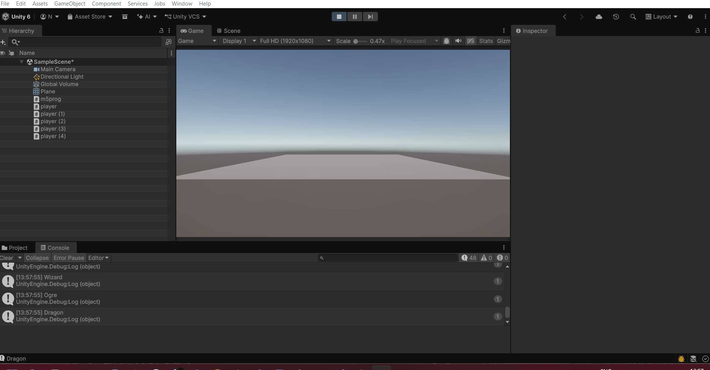
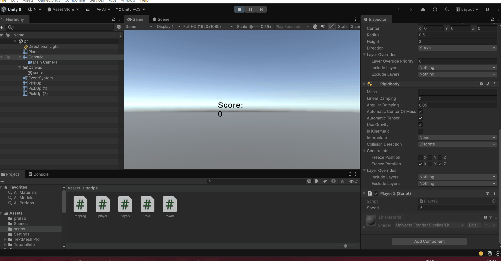
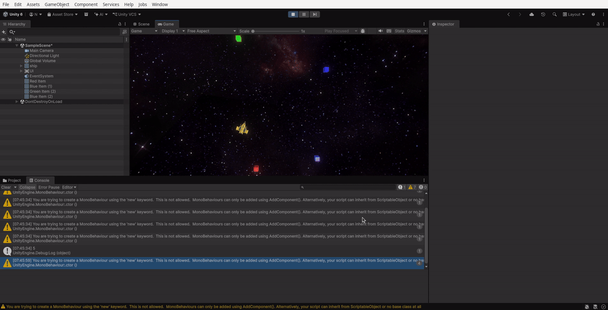

<!-- 
[Al jaren deel ik de lekkerste gebakken cheesecake recepten met jullie, maar ironisch genoeg is het basisrecept er altijd bij ingeschoten. De hoogste tijd dus om mijn simpele cheesecake basisrecept met jullie te delen.

Cheesecake basisrecept maken
Cheesecake, wie houdt er niet van? Het maken van cheesecake klinkt je misschien intimiderend in de oren, maar als je weet hoe makkelijk het is ga je deze heerlijke taart waarschijnlijk nog heel vaak bakken.

Met dit cheesecake basisrecept kun je alle kanten op. Geef de roomkaasvulling bijvoorbeeld een lekker smaakje door het gebruik van citrusvruchten of chocolade en top de bovenkant van de cheesecake af met een smakelijke Italiaanse meringue. Een mooi voorbeeld hiervan is de lemon meringue cheesecake.

Of misschien experimenteer jij liever met verschillende koekjes voor de bodem, of gewoon allebei! Later in dit artikel geef ik je tips voor de verhoudingen tussen allerlei soorten koekjes en de hoeveelheid ongezouten roomboter die je daarmee moet combineren.

TIP! Kun je wel wat cheesecake inspiratie gebruiken? Kijk dan eens tussen één van de vele cheesecake recepten die ik de afgelopen jaren al heb gebakken. De friszure rabarber cheese is ook echt een aanrader.

Basisrecept cheesecake maken
Verschillende koekjes voor de bodem
De eerste stap bij het bakken van een cheesecake is het maken van de bodem. Hiervoor kun je allerlei soorten koekjes (of zelfs noten) gebruiken.

Meng de koekkruimels met roomboter en druk het aan in de bodem van je springvorm. De bodem zet je in de koelkast terwijl je de vulling maakt.

Voor het variëren met de koekjesbodem geef ik je een aantal extra richtlijnen die het net even makkelijker maken. Sommige soorten koekjes bevatten van zichzelf al meer boter en daardoor hoef je er ook minder boter aan toe te voegen om er een lekkere cheesecake bodem van te maken.

Onderstaand vind je een overzicht van de meest gebruikte koekjes in cheesecake, in combinatie met hoeveel ongezouten roomboter je in grammen nodig hebt om de perfecte koekbodem voor jouw cheesecake te bakken.

Deze hoeveelheden zijn genoeg voor een cheesecake van 24 cm.

200 gram digestive koekjes – 100 gram boter
240 gram theebiscuitjes – 100 gram boter
260 gram Bastognekoeken – 100 gram boter
340 gram Oreo’s – 30 gram boter
285 gram chocolate chip koekjes – 85 gram boter
240 gram kruidnoten – 100 gram boter
TIP! Wist je dat je ook schattige mini cheesecakejes kunt bakken? Of wat dacht je van een cheesecake met boterkoek als bodem?

Het complete basisbakboek 
Deze bakbijbel met ruim 150 recepten wil iedere thuisbakker in huis hebben. Ga aan de slag met een van de 40 basisrecepten, elk met twee variaties. Het zijn zowel tijdloze klassiekers als veel spiksplinternieuwe recepten. Daarnaast bevat dit boek recepten voor vullingen en toppings, maar ook handige baktips en bewaaradviezen zoals je van mij gewend bent.  

Bestel hier!

Afbeelding
Cheesecake bewaren
Voor het maken van cheesecake moet je wat tijd uittrekken. Voordat de taart afgekoeld is in de oven en opgesteven in de koelkast ben je namelijk een aantal uur verder.

Tenzij je de cheesecake ’s avonds nodig hebt, zou ik dus altijd een dag eerder beginnen met maken.

Hoe lang kun je cheesecake bewaren?
In de koelkast blijft de cheesecake 3-4 dagen goed, dek hem af of plaats in een luchtdichte verpakking.

Cheesecake invriezen
Invriezen kan ook, dan blijft de taart tot 1 maand goed. Je kunt de taart als geheel invriezen, maar al in punten gesneden is ook erg handig.

recept voor basisrecept mini cheesecakes

Cheesecake met een boterkoekbodem

Veelgestelde vragen: cheesecake recept
Wat is de beste roomkaas voor cheesecake?
Eigenlijk kun je alle soorten naturel roomkaas gebruiken, of het nu een huismerk of een A-merk is.

Zelf gebruik ik meestal de naturel roomkaas van Philadelphia. Tenzij ik een MonChou taart maak natuurlijk, dan gebruik ik de kleine pakjes (stevige) roomkaas van MonChou. Van MonChou heb je ook een ‘zacht en romig’ variant, die gebruik ik liever niet omdat het eindresultaat dan minder stevig zal zijn.

Hoe krijg je een cheesecake het beste uit de bakvorm?
Door een springvorm met een losse bodem te gebruiken (zoals deze springvorm), de vorm in te vetten en daarna zowel de bodem als de zijkanten met bakpapier te bekleden.

Haal de cheesecake pas uit de vorm als deze gebakken, afgekoeld en in de koelkast opgesteven is. Maak de springvorm voorzichtig los en verwijder het bakpapier van de randen. Schuif de cheesecake dan naar een grote snijplank of taartplateau waarop je de cheesecake kunt versieren, snijden en/of serveren.

Hoe voorkom ik scheuren in mijn cheesecake?
In mijn ervaring komt dit neer op de juiste temperatuur van je oven gedurende het bakproces van de cheesecake, maar ook tijdens het afkoelen ervan.

Ik bak de cheesecake het liefst op een lage temperatuur met een klein ovenschaaltje met heet water in de oven erbij. Laat de taart na het bakken in de oven afkoelen met de deur dicht of op een klein kiertje. Dan is de kans op scheuren het kleinst.

Ik heb een scheur in mijn cheesecake, wat nu?
Geen zorgen! Dit kun je makkelijk verbloemen door de bovenkant van je cheesecake te decoreren met een heerlijke topping. Bijvoorbeeld lemon curd, slagroom of Italiaanse meringue. Deze cheesecakes zijn daar goede voorbeelden van, omdat ze een rijke topping hebben:

Kokoscheesecake
Kinder chocolade cheesecake
Lemon meringue boterkoek cheesecake
Hoe weet je wanneer een cheesecake gaar is?
Een gebakken cheesecake is gaar wanneer de randen stevig aanvoelen, maar de binnenkant nog wiebelig is. Tijdens het afkoelen en het opstijven in de koelkast zal de gehele cheesecake stevig worden.

Hoe maak je een basis cheesecake

1/4
 

Basisrecept cheesecake maken
 Opslaan
 Recept afdrukken

4.65 van 110 stemmen
Recept omrekenen
English
Bakstand
* Bakstand voorkomt dat je scherm uit gaat

Cheesecake basisrecept
Met dit makkelijke basisrecept voor een gebakken cheesecake kun je echt alle kanten op.
Voorbereiding
15minuten min
Bereiding
1uur uur
Opstijven
4uur uur
Totaal
5uur uur 15minuten min
Porties: 12 personen
voor een springvorm van 24 cm
Ingrediënten
Bodem
260 gram Bastognekoeken
100 gram ongezouten roomboter
Cheesecake
600 gram roomkaas (Philadelphia)
180 gram fijne kristalsuiker
4 eieren
125 gram zure room
2 tl vanille-extract
15 gram patentbloem
Direct in je mandje bij:
albert-heijnjumbo1
Benodigdheden
Springvorm 24 cm
Instructies
Vet de springvorm in en bekleed met bakpapier. Maal de koeken fijn. Smelt de boter en roer de koekkruimels door de gesmolten boter tot een kruimelig en plakkerig mengsel. Stort het in een met bakpapier beklede springvorm en druk stevig aan.
Maak de vulling, oftewel het beslag, voor de cheesecake. Klop de roomkaas en suiker romig. Voeg de eieren één voor één toe en mix kort tot deze zijn opgenomen.
Roer de vanille-extract samen met de zure room los en voeg al mixend toe. Voeg 15 gram bloem toe en klop tot een glad geheel, maar niet te lang.
Giet het beslag op de koekbodem en strijk glad met een spatel. Bak de cheesecake in 60 minuten gaar op 150 °C in een voorverwarmde oven (boven- en onderwarmte). Zet er een ovenschaaltje met heet water op het rooster in de oven bij.
Zet na het bakken de oven uit en laat de cheesecake afkoelen met de ovendeur dicht of op een kleine kier. Zodra de cheesecake lauw of op kamertemperatuur is zet je deze in de koelkast en laat je deze minstens 4 uur opstijven.
Serveer de cheesecake bijvoorbeeld met toeven slagroom en versier met vers fruit of koekjes.

Recept ontvangen in je inbox?
Vul je e-mail in en ik stuur het recept gelijk toe. Daarmee schrijf je je ook in voor mijn nieuwsbrief met nog meer lekkere recepten.

Ik ga ermee akkoord dat mijn persoonlijke gegevens worden gebruikt voor op interesses gebaseerde advertenties, zoals uitgelegd in de Privacyverklaring en op de Advertentiepartners-pagina.
Voornaam
Website
Jouw e-mail...
Stuur het recept
Tips
Kan jouw ovendeur niet op een kier blijven staan, steek er dan een houten pollepel tussen.
Je kunt de koekjesbodem van de cheesecake ook tegen de zijkanten van de bakvorm aan plakken, zoals ik bij mijn confetti cheesecake deed. Doe dit tot ongeveer 3 cm hoog.
Lees hier meer tips voor de perfecte cheececake.
Bewaren
Afgedekt in de koelkast 3-4 dagen houdbaar, in de vriezer tot 3 maanden. dit is een test of er ai word gebruik om het werk na tekijken] 
-->
# prog-m5
# opdrach 1
# 
# [code](Assest/scrips/m5prog) [code](Assest/scrips/tower)
# 
# opdracht 2
# 
# [code](Assest/scrips/Player2)
# opdracht 4
# 
# [repo](https://github.com/NamesSR/Space48)
